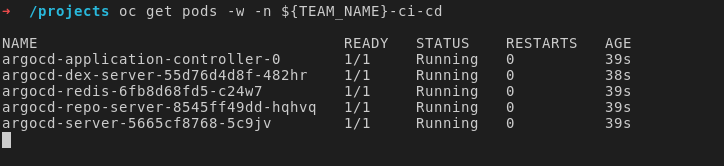
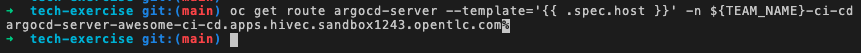
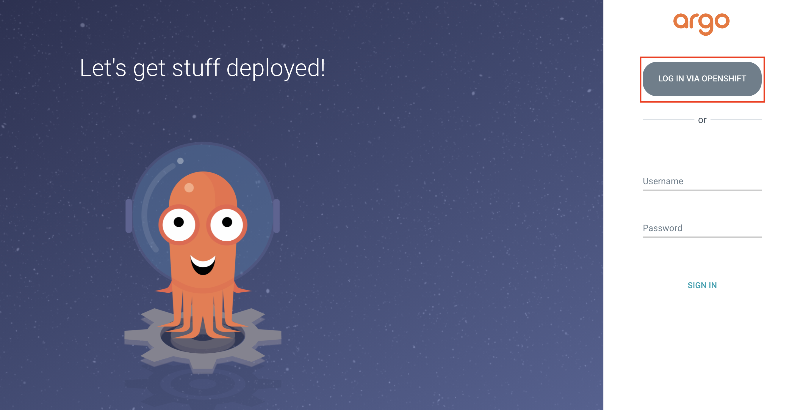
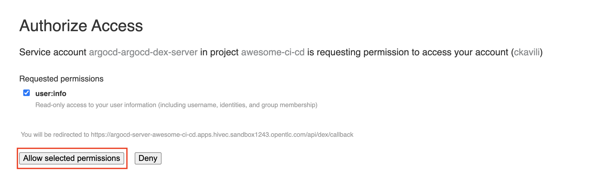
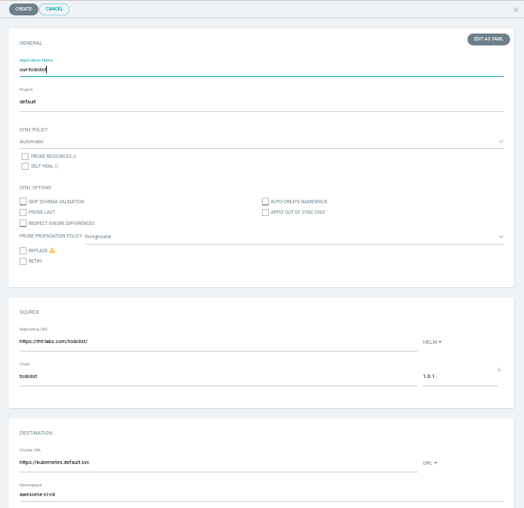
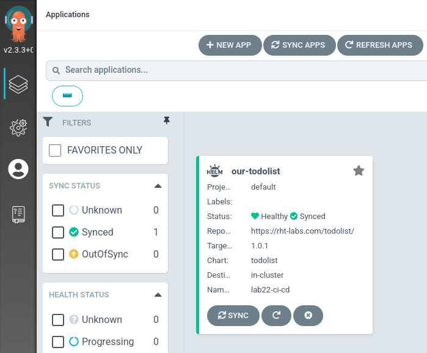
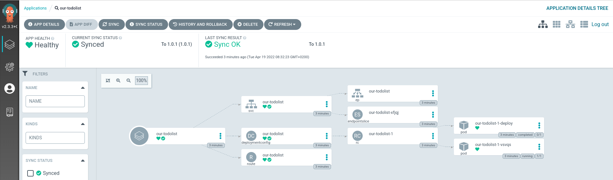

## 🐙 ArgoCD - GitOps コントローラー

GitOps は、Ops に対する開発者中心のアプローチと見なすことができます。開発者は、マシンから離れたコードの所有権を取得するための優れたプラクティスと、このコードが実行された後にデプロイおよび監視する方法を学ぶことができます。

GitOps を理想的に実践する場合、すべてのアクションは冪等でなければなりません。すべてのアクションまたは操作を複数回適用して、まったく同じ結果を得ることができます。これは、意図しない結果を引き起こすことなく、必要に応じて操作を繰り返したり再試行したりできることを意味するため、多くの状況で非常に便利なプロパティです。構成は宣言的に作成する必要があります。つまり、構成を記述して、アプリケーションまたはアプリのセットの望ましい状態を記述します。

Helm チャートに GitOps アプローチを実装するために必要なことは、ツールを Git リポジトリに接続することだけです。これにより、アラートを送信したり、変化を監視したりできます。これらの変更が到着すると、このツールは現在の状態と望ましい状態の違いを評価し、変更を自動的に適用できます。

ArgoCD の Web サイトでは、次のようなツールとして説明されています。

<div class="highlight" style="background: #f7f7f7">
<pre>    automates the deployment of the desired application states in the specified target
    environments. Application deployments can track updates to branches, tags, or be pinned
    to a specific version of manifests at a Git commit.
</pre>
</div>

Git で必要な状態に一致しないものがあると見なされると、アプリケーションは非同期になります。 GitOps の実装方法に応じて、ArgoCD は変更を再同期して Git にあるものをすぐに適用したり、警告を発して他のワークフローを開始したりできます。 ArgoCD によって実装された継続的デリバリーの世界では、Git が信頼できる唯一の情報源であるため、そこに見られる変更を常に適用する必要があります。

### ArgoCD 基本インストール

> ArgoCD は、最も人気のある GitOps ツールの 1 つです。これにより、OpenShift アプリケーションの状態が git リポジトリと同期されます。 ArgoCD は、Git リポジトリに保存されているもの (望ましい状態) と、クラスター内にあるもの (実際の状態) を調整するファンシー パンツ コントローラーです。これらの違いに基づいて ArgoCD がアクションを実行するように構成できます。たとえば、git からクラスターへの変更を自動同期したり、問題が発生したことを知らせる通知を発行したりできます。

1. ArgoCD を使い始めるために、ArgoCD のインスタンスをクラスターにデプロイする Helm チャートを作成しました。ターミナル (IDE) で、redhat-cop helm charts リポジトリを追加します。これは、顧客との経験から現場のコンサルタントによってキュレーションされたチャートのコレクションです。プルリクエストは大歓迎です:P

    ```bash#test
    helm repo add redhat-cop https://redhat-cop.github.io/helm-charts
    ```

2. クラスターセットアップの一部としてデプロイされた[Red Hat GitOps Operator](https://github.com/redhat-developer/gitops-operator)を使用しています。通常、この手順は Operator インストールの一部として実行されるため、必要以上に複雑になります。事前にあなたのチーム名*を知らなかった*ので 👻Operator サブスクリプションの環境変数を更新する必要があります。これにより、クラスター スコープの ArgoCD インスタンスを &lt;TEAM_NAME&gt;-ci-cd プロジェクトにデプロイすることを Operator に通知します。次のシェル スクリプトを実行します。

     <p class="tip">🐌 これは GITOPS ではありません - これを自動化するためのより良い方法が見つかるまで。 🐎 このシェル スクリプトをコピーした後、端末に "...." が表示されても心配はいりません。リターンを押すと、設計どおりに実行されます。</p>


    ```bash#test
    run()
    {
      NS=$(oc get subscriptions.operators.coreos.com/openshift-gitops-operator -n openshift-operators \
        -o jsonpath='{.spec.config.env[?(@.name=="ARGOCD_CLUSTER_CONFIG_NAMESPACES")].value}')
      opp=
      if [ -z $NS ]; then
        NS="${TEAM_NAME}-ci-cd"
        opp=add
      elif [[ "$NS" =~ .*"${TEAM_NAME}-ci-cd".* ]]; then
        echo "${TEAM_NAME}-ci-cd already added."
        return
      else
        NS="${TEAM_NAME}-ci-cd,${NS}"
        opp=replace
      fi
      oc -n openshift-operators patch subscriptions.operators.coreos.com/openshift-gitops-operator --type=json \
        -p '[{"op":"'$opp'","path":"/spec/config/env/1","value":{"name": "ARGOCD_CLUSTER_CONFIG_NAMESPACES", "value":"'${NS}'"}}]'
      echo "EnvVar set to: $(oc get subscriptions.operators.coreos.com/openshift-gitops-operator -n openshift-operators \
        -o jsonpath='{.spec.config.env[?(@.name=="ARGOCD_CLUSTER_CONFIG_NAMESPACES")].value}')"
    }
    run
    ```

    出力は次のようになり、他のチームも追加されます。

     <div class="highlight" style="background: #f7f7f7">
     <pre><code class="language-bash">
          subscriptions.operators.coreos.com/openshift-gitops-operator patched
          EnvVar set to: &lt;TEAM_NAME&gt;-ci-cd,anotherteam-ci-cd
        </code></pre>
    </div>
    

3. ArgoCD の基本的なインストールを実行しましょう。チャートで定義されているほとんどのデフォルトを使用することで、このユース ケースには十分です。

    また、シークレット 🔐 を使用して Git リポジトリからプルできるように ArgoCD を構成します。

    少しの yaml を作成して、ArgoCD インスタンスを &lt;TEAM_NAME&gt;-ci-cd 名前空間のシークレットで構成します 😋:

    ```bash#test
    cat << EOF > /projects/tech-exercise/argocd-values.yaml
    ignoreHelmHooks: true
    operator: []
    namespaces:
      - ${TEAM_NAME}-ci-cd
    argocd_cr:
      initialRepositories: |
        - url: https://${GIT_SERVER}/${TEAM_NAME}/tech-exercise.git
          type: git
          passwordSecret:
            key: password
            name: git-auth
          usernameSecret:
            key: username
            name: git-auth
          insecure: true
    ```

EOF ```

```
Then, deploy ArgoCD using helm and this piece of yaml:

```bash#test
helm upgrade --install argocd \
  --namespace ${TEAM_NAME}-ci-cd \
  -f /projects/tech-exercise/argocd-values.yaml \
  redhat-cop/gitops-operator
```

<p class="tip">
⛷️ <b>NOTE</b> ⛷️ - It's also worth noting we're allowing ArgoCD to run in a fairly permissive mode for these exercise, it can pull charts from anywhere. If you're interested in securing ArgoCD a bit more, checkout the <span style="color:blue;"><a href="/#/1-the-manual-menace/666-here-be-dragons?id=here-be-dragons">here-be-dragons</a></span> exercise at the end of this lab.
</p>
```

1. OpenShift をチェックインすると、Operator Pod が起動し、(最終的に) argocd-server、dex、およびその他の Pod がスピンアップするのがわかります。これを行うには、「watch」フラグを指定してコマンドを実行し、Pod の作成を継続的に監視します。

    ```bash
    oc get pods -w -n ${TEAM_NAME}-ci-cd
    ```

    

    *次のステップに進むには、Control+C を実行して「ウォッチ」モードを解除する必要があります。すべてのポッドが実行されたら*

2. すべてのポッドが起動して実行されると、ArgoCD の UI にログインできます。ルートを取得し、新しいブラウザー タブで開きます。

    ```bash#test
    echo https://$(oc get route argocd-server --template='{{ .spec.host }}' -n ${TEAM_NAME}-ci-cd)
    ```

    

3. [ `Log in via OpenShift` ] をクリックして ArgoCD にログインし、提供された OpenShift 資格情報を使用します。

4. 最初のログインで選択し`Allow selected permissions`します。

5. ArgoCD にログインしました👏👏👏! UI を使用してサンプル アプリケーションをデプロイしてみましょう。実際、前に手動でデプロイした`todolist`アプリを ArgoCD でデプロイしてみましょう。 ArgoCD で、[ `CREATE APPLICATION`の作成] をクリックします。空のフォームが表示されます。次のように設定して入力しましょう。

    - 「一般」ボックスについて
        - アプリケーション名: `our-todolist`
        - プロジェクト: `default`
        - 同期ポリシー: `Automatic`
    - 「SOURCE」ボックスについて
        - リポジトリ URL: `https://rht-labs.com/todolist/`
        - 右のドロップダウン メニューから`Helm`を選択します。
        - チャート: `todolist`
        - バージョン: `1.1.0`
    - 「DESTINATION」ボックスに
        - クラスター URL: `https://kubernetes.default.svc`
        - 名前空間: `<TEAM_NAME>-ci-cd`
    - 「HELM」ボックスについて
        - 値ファイル: `values.yaml`

    フォームは次のようになります。 

6. 作成をクリックすると`our-todolist`アプリケーションが作成され、 `${TEAM_NAME}-ci-cd`名前空間でデプロイを開始するはずです。

7. アプリケーションをドリルダウンすると、チャートによって生成されたすべての k8s リソースの ArgoCD の素晴らしいビューが表示されます

8. 前の helm デプロイで行ったのと同じ方法で、アプリの URL に移動することで、アプリケーションが実行され、期待どおりに動作していることを確認できます。

    ```bash
    echo https://$(oc get route/our-todolist -n ${TEAM_NAME}-ci-cd --template='{{.spec.host}}')
    ```

🪄🪄マジック！これで ArgoCD がデプロイされ、アプリケーションを手動でデプロイできるようになりました。次に、ArgoCD に実際の GitOps を実行させます*🪄🪄*
